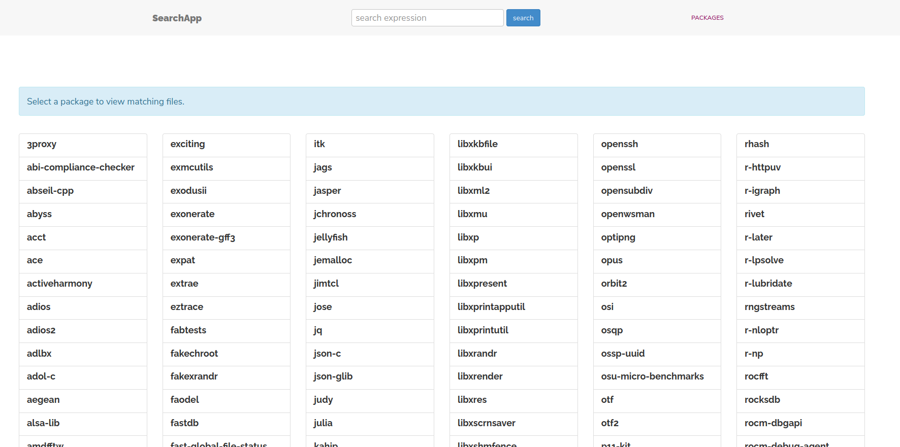
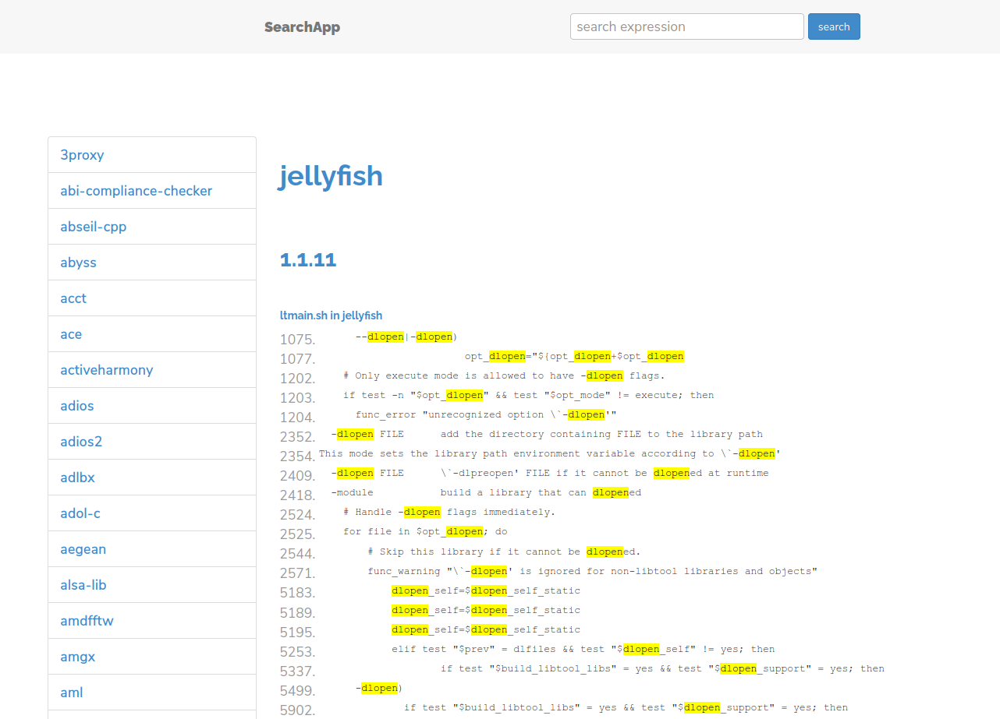
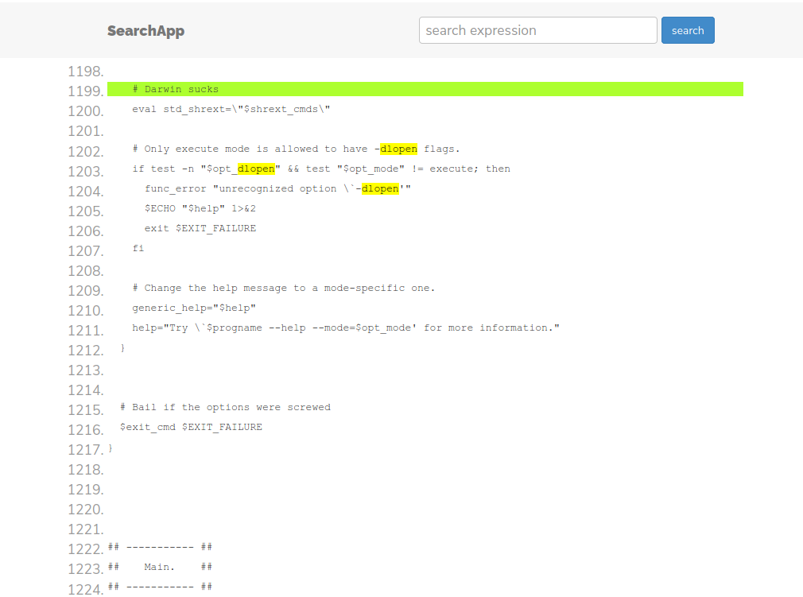
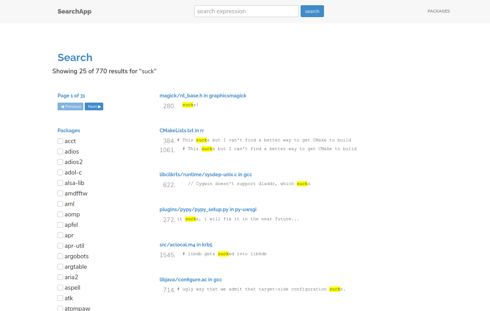

# Spack Search App

This is a quick application that combines elasticsearch with postgres to
add all code files to the database in a mode, and then easily search over them.
It is derived from [django-polls-elasticsearch](https://github.com/slyapustin/django-polls-elasticsearch).

## Setup

You'll need [Docker](https://docs.docker.com/get-docker/) and [docker-compose](https://docs.docker.com/compose/install/)
installed on your system.

### 1. Build containers

You'll first want to build your search container.

```bash
$ docker-compose build
```

Then bring up containers:

```bash
$ docker-compose up -d
```

And ensure that they are running, without error:

```bash
$ docker-compose ps
       Name                      Command               State                       Ports                     
-------------------------------------------------------------------------------------------------------------
app_app_1             bash -c sleep 15 && python ...   Up      0.0.0.0:80->8000/tcp                          
app_elasticsearch_1   /docker-entrypoint.sh elas ...   Up      0.0.0.0:9200->9200/tcp, 0.0.0.0:9300->9300/tcp
app_postgres_1        docker-entrypoint.sh postgres    Up      5432/tcp     
```

You can check logs as follows:

```bash
$ docker-compose logs app
$ docker-compose logs nginx
$ docker-compose logs postgres
$ docker-compose logs elasticsearc
```

Particularly you want to check that all migrations were run, if you look at logs for "app" and scroll up from
the wsgi workers you should see this:

```bash
$ docker-compose logs app
```
```
...
app_1            | No changes detected in app 'source'
app_1            | Operations to perform:
app_1            |   Apply all migrations: admin, auth, contenttypes, sessions, source
app_1            | Running migrations:
app_1            |   Applying contenttypes.0001_initial... OK
app_1            |   Applying auth.0001_initial... OK
app_1            |   Applying admin.0001_initial... OK
app_1            |   Applying admin.0002_logentry_remove_auto_add... OK
app_1            |   Applying admin.0003_logentry_add_action_flag_choices... OK
app_1            |   Applying contenttypes.0002_remove_content_type_name... OK
app_1            |   Applying auth.0002_alter_permission_name_max_length... OK
app_1            |   Applying auth.0003_alter_user_email_max_length... OK
app_1            |   Applying auth.0004_alter_user_username_opts... OK
app_1            |   Applying auth.0005_alter_user_last_login_null... OK
app_1            |   Applying auth.0006_require_contenttypes_0002... OK
app_1            |   Applying auth.0007_alter_validators_add_error_messages... OK
app_1            |   Applying auth.0008_alter_user_username_max_length... OK
app_1            |   Applying auth.0009_alter_user_last_name_max_length... OK
app_1            |   Applying auth.0010_alter_group_name_max_length... OK
app_1            |   Applying auth.0011_update_proxy_permissions... OK
app_1            |   Applying sessions.0001_initial... OK
app_1            |   Applying source.0001_initial... OK
app_1            |   Applying source.0002_auto_20210213_2049... OK
app_1            |   Applying source.0003_auto_20210213_2107... OK
...
```

You should then be able to navigate to localhost. to see the simple interface, meaning
either at [http://localhost](http://localhost) or [http://127.0.0.1](http://127.0.0.1).


But wait... we haven't added any package source files yet! 
Let's do that first.

### 2. Add Packages

You should have already cloned the repository, including all the raw package files
in the [dlopen](../dlopen) folder. If you notice in the [docker-compose.yml](docker-compose.yml),
we've actually bound this folder from the host at `/data`.

```yaml
  app:
    build: .
    depends_on:
      - postgres
      - elasticsearch
    volumes:
      - ./:/code/
      - ../dlopen:/data/     # <-------- dlopen files bound to /data
```

We can then run a management command to import these files, directing
to the `/data` folder. Since this is just a small demo, the script
will only import one version of each package file, the rationale being
it takes less time, is a faster interface, and likely we can get
an understanding of packages' use of dlopen with just one version.

```bash
$ docker exec -it app_app_1 python manage.py add_packages /data
```
```bash
Data directory: /data
Found 5164 package files.
Only importing one version for package for demo purposes
GET /haystack/_mapping [status:404 request:0.035s]
Added package 1 of 1133: fpocket version master
Added package 2 of 1133: osqp version master
Added package 3 of 1133: libid3tag version 0.15.1b
Added package 4 of 1133: comgr version 3.9.0
Added package 5 of 1133: cryptsetup version 2.3.1
Added package 6 of 1133: libunistring version 0.9.8
...
```

Currently we are not able to add sourcefiles with null characters, so you'll see
this message if they are found (and if you have an idea for how to address this,
please [open an issue](https://github.com/spack/spack-search/issues). It could be
as simple to replace these characters with something else?

```bash
Issue with gcc sourcefile gcc/doc/gcc.info, likely NUL characters.
Issue with gcc sourcefile gcc/doc/gccint.info, likely NUL characters.
Issue with gcc sourcefile gcc/doc/gccinstall.info, likely NUL characters.
Issue with gcc sourcefile gcc/doc/gcj.info, likely NUL characters.
Added package 28 of 1133: gcc version 6.1.0
```

Note that if we imported everything, since there are several thousand packages, 
each with multiple versions and for each version anywhere between 1 and a 
few hundred matches (files with dlopen) it might take over an hour. 
If this were some production deployed application, we likely would have to do some kind of initial import, and then have
some CI workers trigger a smaller update for a new package, version, matches set.
This import also assumes the json format of the files in the [dlopen](../dlopen)
folder, so you can imagine other ways that the data might be added (e.g., a RESTful API).
Keep in mind that there is no authentication for this currently, so you should
only be using it locally.

### 3. Indexing

Once you add packages, we need to use the haystack django integration to update our indices.
This could be further automated, but I'm walking you through it so you know what is going on.

First rebuild:

```bash
$ docker exec -it app_app_1 python manage.py rebuild_index
```
```bash
WARNING: This will irreparably remove EVERYTHING from your search index in connection 'default'.
Your choices after this are to restore from backups or rebuild via the `rebuild_index` command.
Are you sure you wish to continue? [y/N] y
Removing all documents from your index because you said so.
All documents removed.
Indexing 1133 packages
GET /haystack/_mapping [status:404 request:0.002s]
Indexing 7763 source files
```

If you get an errors, you should check the elasticsearch logs. For example,
I first got a Connection Refused error, and ultimately needed to create my [own
elasticsearch config](elasticsearch/config.yml) to increase the maximum content length (the files are really
big):

```yaml
network.host: 0.0.0.0
http.max_content_length: 300M
```

We also see an error about a missing "mapping" endpoint but it continues to run
without issue. The error is [reported](https://github.com/django-haystack/django-haystack/issues/1142)
already on the issue tracker. Note that the [rebuild_index](https://django-haystack.readthedocs.io/en/master/management_commands.html#rebuild-index) command is actually performing a `clear_index` and then `update_index`. If you later add new
records and don't want to clear it first, you can just run update index as follows 
(and note that these are management commands provided by haystack):

```bash
$ docker exec -it app_app_1 python manage.py update_index
```

### 4. Explore Packages

Now in the interface you can navigate to "Packages" and see a huge list to
select from!



This view is provided if you simply want to browse by package. When you
click on any package, you'll see a list of all it's versions and a filtered
set of lines that contain the string "dlopen" (since this is what we are interested 
in).



Note that for some packages with a huge number of files (e.g., openmpi) we might
want to consider rendering each version as it's own page. It currently takes
too long to load. 

From the package view (which show snippets of files with matches
for dlopen) we can then then click any line to be taken to the expanded sourcefile view, meaning that you
see the entire file. The image below shows that again, instances of dlopen are highlighted. 
When you highlight a line it appears in yellow, and when you click it there is a permalink
that moves the line to the top, and turns it green (also shown below). This could
be customized to allow you to highlight / search for custom terms, but for
now it's just hard coded :)




### 5. Search Packages

The search box at the top will search across all the source file code, giving
you a result interface where you can see a filtered set of lines with the result,
and also filter by the package name. We could add additional filters here, but
for now package name seems reasonable.



This is fairly slow, so I'm going to refactor it so the user chooses a package first,
and then searches. We could also look into ways to make it faster. 
And that's the gist of it! It's a fairly simple interface and can be updated as needed.


## 6. Debugging Tips

It sometimes might be the case that you want to shell into the main application container,
and run migrations or otherwise ensure that things look ok.
For example, if you want to check that migrations ran successfully, you can look at the logs,
or shell into the container and run these commands manually.

```bash
$ docker exec -it app_app_1_bash
$ python manage.py makemigrations source
$ python manage.py migrate
$ python manage.py collectstatic --noinput
```

From the outside of the container, you can also check the status of elastic search via the RestFul API:

```bash
$ curl http://127.0.0.1:9200/
{
  "name" : "Mogul of the Mystic Mountain",
  "cluster_name" : "elasticsearch",
   ...
  "tagline" : "You Know, for Search"
}
```
```bash
$ curl http://127.0.0.1:9200/_cat/health
1613250927 21:15:27 elasticsearch yellow 1 1 5 5 0 0 5 0 - 50.0% 
```

If you have any additional questions or suggestions for development, please
[open an issue](https://github.com/spack/spack-search/issues).

## TODO

 - require user to search across package (create search page limited to package)
 - only load one version for now
